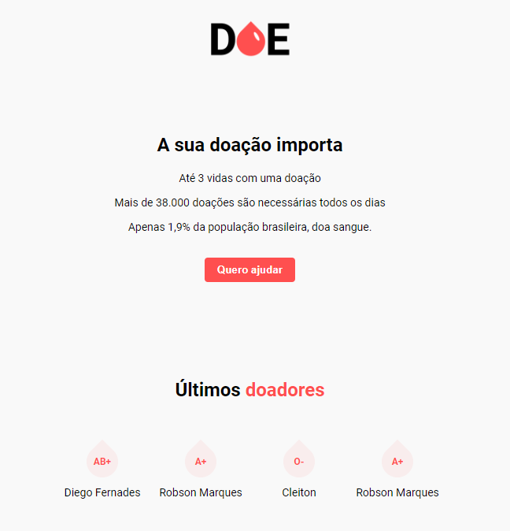
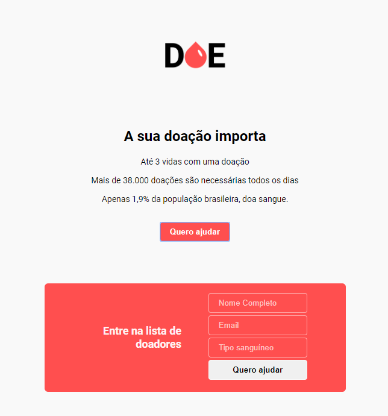

# MaratonaDev3

## Aplicação criada durante o MaratonaDev - 3ª edição

## Para rodar a aplicação

``npm install`` 

## Este projeto utilizou:

1. NodeJS
2. CSS / HTML
3. Postgres

### Tela inicial

### Formulário de cadastro

